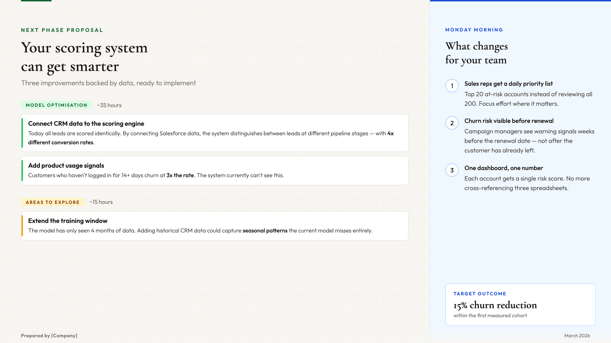

# Client Proposal Slide Generator

A [Claude Code](https://claude.com/claude-code) skill that turns technical analysis into stakeholder-ready HTML presentations — with business activation framing so your audience knows exactly what to do next.


*Example output: a proposal slide with two-tier recommendations, estimated hours, and a "What changes for your team" activation panel.*

## Quick Start

```
You: I have analysis results in results.json — make a client proposal slide

Claude: Before I build the slide, I need to understand the context:
        1. Who will be in the room?

You: VP of Marketing and two campaign managers

Claude: 2. What decision should this drive?

You: Approve 30 hours of model improvements

Claude: 3. What would change for their teams day-to-day?

You: Campaign managers get a daily prioritized list instead of batch-blasting everyone

Claude: [Reads file, translates jargon, builds activation framing,
         produces 3 HTML slides + PDF, opens in browser]
```

The skill auto-triggers when you say things like:
- "Make a slide proposing the model improvements to the client"
- "Create a presentation summarizing the analysis results"
- "Design a deck for the stakeholder meeting"
- "Design a slide" / "make a PPT" / "propose to the client"
- "Present findings to stakeholders" / "turn analysis into a deck"
- "Summarize for the VP" / "build a proposal deck"
- "Translate technical results for the client" / "create a one-pager for the client"
- "Make an HTML slide"

## Installation

### Claude Code (recommended)
```bash
/plugin marketplace add wan-huiyan/claude-client-proposal-slide
/plugin install client-proposal-slide@wan-huiyan-client-proposal-slide
```

Or clone directly:
```bash
git clone https://github.com/wan-huiyan/claude-client-proposal-slide.git ~/.claude/skills/client-proposal-slide
```

### Cursor
```bash
# Per-project rule (most reliable)
mkdir -p .cursor/rules
# Create .cursor/rules/client-proposal-slide.mdc with SKILL.md content + alwaysApply: true

# Or global install
git clone https://github.com/wan-huiyan/claude-client-proposal-slide.git ~/.cursor/skills/client-proposal-slide
```

## What You Get

Four deliverables — self-contained HTML slides (16:9, 1280x720px) plus a PDF:

1. **Detailed** — Full evidence, data points, impact section, activation callout
2. **Minimal** — ~40% less text, same key message, cleaner layout
3. **Bullet-point** — Plain text for traditional-deck stakeholders
4. **PDF** — Print-ready A4 with proper page breaks (no content cut off mid-page)

Each HTML file opens in a browser, screenshots for PowerPoint, or prints to PDF. The PDF version is generated automatically with `@media print` rules that prevent content splitting across pages.

## Why Not Just Ask Claude to Make a Slide?

| Without This Skill | With This Skill |
|--------------------|-----------------|
| Jumps straight to building | Asks who's in the room and what decision this drives |
| "AUC improved from 0.50 to 0.96" | "The system can now distinguish between different customer segments" |
| "The model will be more accurate" | "Each morning, your team gets a prioritized action list — focus on the 40 highest-risk accounts instead of calling all 200" |
| One generic slide | Three versions + PDF tailored to audience |
| Technical metrics as the headline | Business outcomes as the headline |
| You review for accuracy yourself | Optional multi-agent fact-checking panel |

## How It Works

| Step | What Happens |
|------|-------------|
| 1. Discover | Asks about audience, decision, and activation (defaults to general business audience if skipped) |
| 2. Gather | Reads your analysis files (JSON, markdown, SQL output, conversation context) |
| 3. Translate | Converts ML jargon to client-friendly language automatically |
| 4. Categorize | Splits into "Ready to Implement" vs "Worth Exploring" tiers with estimated hours |
| 5. Activate | Defines who acts, what changes, what triggers it, and how to measure success |
| 6. Design | Structures a left-to-right narrative flow |
| 7. Build | Generates three HTML versions via `frontend-design` skill |
| 8. Export | Converts to PDF with proper page breaks |
| 9. Review | *(Optional)* Runs adversarial accuracy panel to fact-check claims |
| 10. Iterate | Refines based on your feedback |

## Key Design Decisions

### Discovery Phase
The skill asks three questions before building: who is the audience, what decision this drives, and what changes for their team. This prevents the most common failure: beautiful slides that don't lead to action.

### Business Activation
Every proposal item answers **"What do I do Monday morning?"**:
- **Who acts** — Named team/role, not "the organization"
- **What changes** — Concrete workflow shift, not "better predictions"
- **What triggers it** — Daily report, dashboard alert, CRM update
- **Expected behavioral change** — How actions differ from today
- **Success metric** — Observable business KPI, not model accuracy

Common activation patterns: prioritized outreach lists, triggered interventions, resource allocation dashboards, campaign targeting, early warning alerts.

### Two-Tier Confidence
Recommendations split into high-confidence ("Model Optimisation" with hours) and exploratory ("Areas We Could Explore" with hours + what validation is needed). This builds trust by showing analytical rigor rather than overselling.

### Jargon Translation
| Technical | Client-Friendly |
|-----------|----------------|
| "AUC improved to 0.96" | "The system can now clearly distinguish between different groups" |
| "features" | "signals" or "data points" |
| "model" | "the system" or "the scoring system" |
| "entropy reduction" | "we can now see meaningful differences where everything looked the same before" |

<details>
<summary>Before/After Examples</summary>

**Before (technical):**
> "Expanding the categorical feature from 4 to 7 categories improves proxy AUC from 0.50 to 0.96 with 62% entropy reduction."

**After (client-friendly):**
> "Today, all submitted applications are scored identically. By connecting to CRM data, the system can distinguish between applicants in review, accepted, and deposited — with dramatically different outcomes at each stage."

**Before (no activation):**
> "The system will produce more accurate predictions by incorporating deposit status data."

**After (activation-focused):**
> "Each morning, your team receives a prioritized outreach list — applicants who've been accepted but haven't converted, ranked by risk of choosing a competitor. Instead of contacting all 200, your team focuses on the 40 most at-risk."
</details>

### Adversarial Accuracy Review
When your deck makes verifiable claims, the skill can trigger a multi-agent review panel to fact-check before you present. Common over-claim patterns it catches:
- Inflated headline numbers (counting variants as distinct capabilities)
- Causal language when only correlation exists
- Universal quantifiers ("every", "all") when coverage is partial

<details>
<summary>Output Quality Checklist</summary>

The skill enforces these checks before delivery:

- Discovery questions answered — audience, decision, activation identified
- No ML jargon (AUC, entropy, precision, recall, F1, log-odds)
- No unvalidated accuracy claims
- All counts verified for deduplication
- Cautious attribution for data source disagreements
- Title tells a story (not a technical label)
- Proposed changes split into two confidence tiers
- Estimated hours included per item
- Business activation defined — each item has: who acts, what changes, success metric
- No orphan proposals — every item answers "what does the stakeholder do differently Monday morning?"
- All three HTML versions + PDF produced
- HTML built via `frontend-design` skill
- PDF has `@media print` rules preventing content from splitting across pages
- If claims reference code/data: accuracy review panel run
</details>

## Dependencies

- **Required:** None — generates self-contained HTML and PDF files
- **Recommended:** `frontend-design` skill for distinctive visual quality (without it, slides are functional but use simpler styling)
- **Optional:** `agent-review-panel` skill for accuracy verification (without it, you review claims manually)

## Related Skills

- **[ml-feature-evaluator](https://github.com/wan-huiyan/ml-feature-evaluator)** — Often produces the analysis results that feed into proposals
- **[ml-training-window-assessor](https://github.com/wan-huiyan/ml-training-window-assessor)** — Proposals involving "more training data" use this skill's output
- **[agent-review-panel](https://github.com/wan-huiyan/agent-review-panel)** — Used for accuracy verification of slide claims

## Version History

| Version | Changes |
|---------|---------|
| 3.2.0 | Enrich trigger description, add eval suite, add composability metadata (schliff score: 64 → 89) |
| 3.1.0 | Added PDF output with `@media print` page break rules, demo screenshot |
| 3.0.0 | Brainstorming discovery phase, business activation section, frontend-design delegation |
| 2.1.0 | Adversarial accuracy review via agent-review-panel |
| 2.0.0 | Initial release |

## Acknowledgements

Trigger accuracy and eval suite improved using [schliff](https://github.com/Zandereins/schliff) — an autonomous skill scoring and improvement framework (composite score: 64 → 89).

## License

MIT
